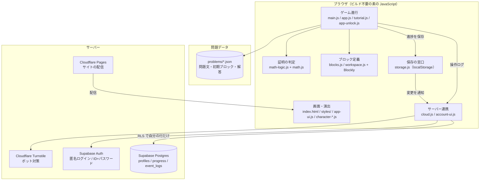

# MathBlock — ブロックで組み立てる数式証明パズル

大阪工業大学 井上明研究室の卒業研究で作成した学習アプリです。
三角関数などの恒等式の証明を、Blockly のブロックを組み立てて行います。

- 公開URL: https://sotuken1.pages.dev/
- プライバシーポリシー: [privacy.html](privacy.html)

## 主な機能

- **ブロックで証明**：変形の手順をブロックで組み立てると、math.js で式が同じかどうかを判定します
- **チュートリアル**：キャラクター（フリエ・パル）の会話に沿って、操作方法を学べます
- **公式の段階的な解放**：問題で初めて出てきた公式を紹介してから使えるようにします
- **ヒント・解説・ギブアップ**：つまずいたときの補助があります
- **進捗の引き継ぎ**：登録なしで始められます。IDとパスワードを作ると、別の端末でも続きから遊べます
- **研究用の操作ログ**：研究への協力に同意した人について、解答を提出するたびに記録します

## 構成



### ファイルの役割

| 分類 | ファイル |
|---|---|
| 状態・保存 | `app-state.js`（状態の唯一の定義元）、`storage.js`（localStorage の窓口） |
| サーバー | `config.js`（接続設定）、`cloud.js`（ログイン・同期・ログ）、`account-ui.js`（アカウント・同意画面） |
| ゲーム進行 | `main.js`（マップ・ステージ読み込み）、`app.js`（ボタン操作・正解判定の呼び出し）、`app-unlock.js`（公式の解放） |
| 判定 | `math-logic.js`（ブロック → 式の変換と同値判定） |
| ブロック | `blocks.js`、`block-svg.js`、`workspace.js` |
| チュートリアル・ガイド | `tutorial.js`、`basics-tutorial*.js`、`pal-tutorial*.js`、`app-guide.js`、`explanations.js` |
| キャラクター | `character-data.js`、`character-dialog.js`、`character-scenes.js`、`character-mascot.js` |
| 演出 | `app-ui.js`、`app-effects.js`、`styles/*.css` |
| 問題 | `problems/1.json`〜、`problems/tutorial/0-*.json`、`problems/index.json`（本編の問題数） |
| DB | `supabase/migrations/*.sql`（表・権限・分析用ビュー） |

## 手元で動かす

```sh
python -m http.server 8080
# → http://localhost:8080 を開く
```

VS Code の Live Server でも動きます。手元（localhost）で開いているときだけ、「全問題を開放」などの開発用機能を使えます。

## 公開

GitHub の `main` にマージすると、Cloudflare Pages が自動で公開します。ビルドはありません。

## 研究データ

研究への協力に同意した人の操作ログだけを記録します。
CSV の取り出し方と、各列の意味は [docs/analysis.md](docs/analysis.md) にまとめています。

## 使用ライブラリ

- [Blockly](https://developers.google.com/blockly) 10.4.3
- [math.js](https://mathjs.org/) 11.8.0
- [MathJax](https://www.mathjax.org/)（解説の数式表示。必要になったときだけ読み込みます）
- [supabase-js](https://github.com/supabase/supabase-js) 2.117.2
